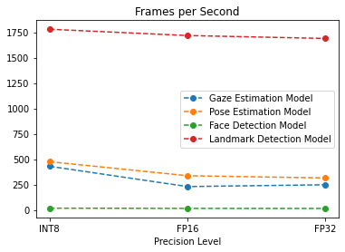
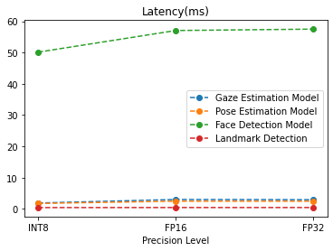
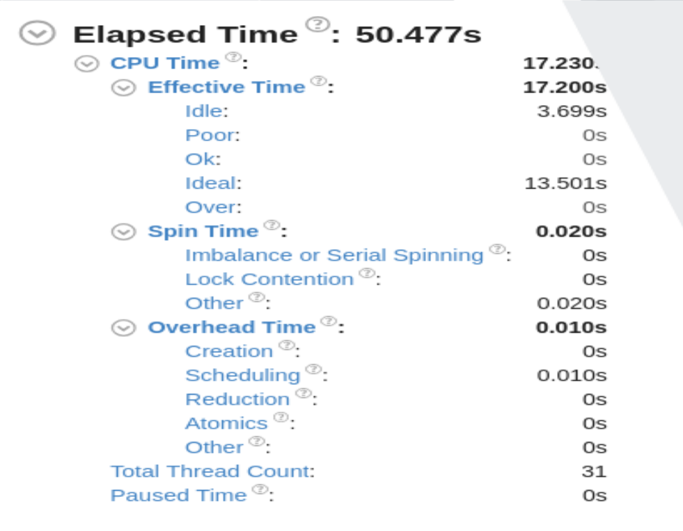
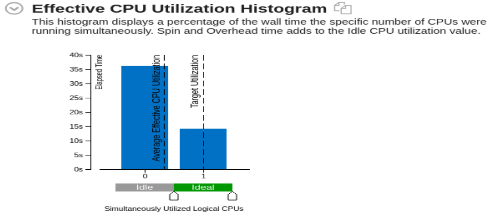
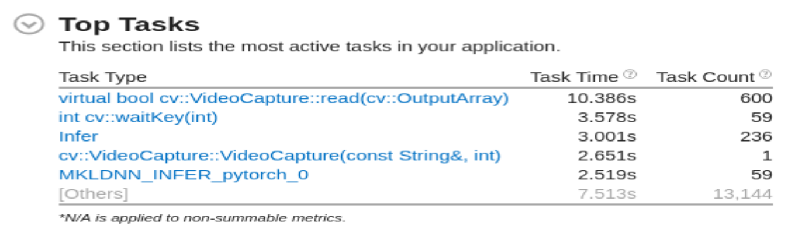

# Computer Pointer Controller

The aim of this Intel OpenVINO based application is to controls the mouse pointer based on movement of eyes with the help of:
1. [Face Detection Model](https://docs.openvinotoolkit.org/latest/_models_intel_face_detection_adas_binary_0001_description_face_detection_adas_binary_0001.html)
2. [Facial Landmarks Detection Model](https://docs.openvinotoolkit.org/latest/_models_intel_landmarks_regression_retail_0009_description_landmarks_regression_retail_0009.html)
3. [Head Pose Estimation Model](https://docs.openvinotoolkit.org/latest/_models_intel_head_pose_estimation_adas_0001_description_head_pose_estimation_adas_0001.html)
4. [Gaze Estimation Model](https://docs.openvinotoolkit.org/latest/_models_intel_gaze_estimation_adas_0002_description_gaze_estimation_adas_0002.html)

Th input can be provided as an camera feed or as a video.

# Project Set Up and Installation

1. To get started download the [Intel OpenVINO API](https://docs.openvinotoolkit.org/latest/). For all kind of help on Intel OpenVINO [visit](https://docs.openvinotoolkit.org/latest/index.html)
2. Once all the above things are done, download the [starter files](https://video.udacity-data.com/topher/2020/April/5e974e37_starter/starter.zip).
3. Extract the files, and "cd" into the folder.
4. Downloading Models 
In order to proceed with the model we need to download all the 4 models.
Note: Since we need to check the project on diffrenent precisions, hence i have not specified "--precision"

    a. for Face Detection Model
    ```
    python3 <openvino directory>/deployment_tools/tools/model_downloader/downloader.py --name "face-detection-adas-binary-0001"
    ```
    b. for landmarks-regression-retail-0009
    ```
    python3 /opt/intel/openvino/deployment_tools/tools/model_downloader/downloader.py --name "landmarks-regression-retail-0009"
    ```
    c. for head-pose-estimation-adas-0001
    ```
    python3 /opt/intel/openvino/deployment_tools/tools/model_downloader/downloader.py --name "head-pose-estimation-adas-0001"
    ```
    d. for gaze-estimation-adas-0002
    ```
    python3 /opt/intel/openvino/deployment_tools/tools/model_downloader/downloader.py --name "gaze-estimation-adas-0002"
    ```
5. Execute the following command, inorder to install the required dependencies
    ```
    python3 -m pip install -r requirenment.txt
    ```
6. Inorder to check for performance measure, install Intel DL Workbench and Intel VTune Profiler. 
7. You can download Intel DL Workbench from [here](https://docs.openvinotoolkit.org/latest/_docs_Workbench_DG_Install_Workbench.html)
8. You can download VTune Amplifier from [here](https://software.intel.com/en-us/vtune/choose-download#standalone)

# Demo
In order to start programming run the following:
### 1. Linux/Mac

To set up the virtual enviornment

```
source /opt/intel/openvino/bin/setupvars.sh 
```
to run the OpenVINO application
```
python3 main.py -f ../intel/face-detection-adas-binary-0001.xml -fl ../intel/landmarks-regression-retail-0009.xml -hp ../intel/head-pose-estimation-adas-0001.xml -g ../intel/gaze-estimation-adas-0002.xml -i ../bin/demo.mp4 -pt 0.6 -d "CPU" -fg 3
```
### 2. Windows
To set up the virtual enviornment
```
call "c:\Program Files (x86)\IntelSWTools\openvino\bin\setupvars.bat"
```
to run the OpenVINO application
```
echo "python main.py -f ../intel/face-detection-adas-binary-0001.xml -fl ../intel/landmarks-regression-retail-0009.xml -hp ../intel/head-pose-estimation-adas-0001.xml -g ../intel/gaze-estimation-adas-0002.xml -i ../bin/demo.mp4 -pt 0.6 "
```
```
python main.py -f ../intel/face-detection-adas-binary-0001.xml -fl ../intel/landmarks-regression-retail-0009.xml -hp ../intel/head-pose-estimation-adas-0001.xml -g ../intel/gaze-estimation-adas-0002.xml -i ../bin/demo.mp4 -pt 0.6 -d "CPU" -fg 3
```

# Documentation
1. -f, --face_detection_model 

    path of the face detection model xml file
    required = True
    
2. -fl, --facial_landmark_model

    path of the landmarks detection model xml file
    required = True
    
3. -hp, --head_pose_model

    path of head position model xml file
    required = True
    
4. -g, --gaze_estimation_model

    path of gaze estimatiob model xml file
    required = True
    
5. -i, --input

    path of the input file, or you can provide 'CAM', if you wish to provide the camera feed
    required = True
    
6. -l, --cpu_extension

    path of the cpu extension file
    required = False
    
7. -pt, --prob_threshold

    the value of threshold value, the result above this value should be returned by the model
    required = False
    
8. -fg, --perf_flag

    Return the performance of individual layers
        "1 for face detection"
        "2 for Facial landmark detection"
        "3 for Head Pose Estimation"
        "4 for Gaze Estimation"
    required = False
    
9. -d, --device

    name of the device (CPU/GPU/VPU/FPGA) on which we wish to run the inference
    required = True

# Benchmarks
* Gaze Estimation Model
  | Precision level | FPS     | Latency(ms) | Total Execution Time (sec) |
  |-----------------|---------|-------------|--------------------------- |
  | INT 8           |  429.98 |  1.89       |  20.00306                  |
  | FP16            |  230.25 |  3.03       |  20.00457                  |
  | FP32            |  247.96 |  2.95       |  20.0031                   |
* Face Detection Model
  | Precision level | FPS    | Latency(ms) | Total Execution Time (sec) |
  |-----------------|--------|-------------|--------------------------- |
  | INT 8           |  17.41 |  50.12      |  20.05071                  |
  | FP16            |  15.53 |  57.04      |  20.08651                  |
  | FP32            |  15.13 |  57.49      |  20.09231                  |
* Head Pose Estimation Model
  | Precision level | FPS     | Latency(ms) | Total Execution Time (sec) | 
  |-----------------|---------|-------------|--------------------------- |
  | INT 8           |  475.4  |  50.12      |  20.05071                  |
  | FP16            |  337.17 |  57.04      |  20.08651                  |
  | FP32            |  314.91 |  57.49      |  20.09231                  |
* Landmarks Detection Model
  | Precision level | FPS     | Latency(ms) | Total Execution Time (sec) |
  |-----------------|---------|-------------|--------------------------- |
  | INT 8           | 1779.73 |  0.43       |  20.0008                   |
  | FP16            | 1717.70 |  0.45       |  20.00058                  |
  | FP32            | 1788.89 |  0.45       |  20.00073                  |

## FPS


## Latency


## Total Evaluation Time


# Results
### Elapsed Time


1. As it can been see in the Total time that the whole application tooks is 50.477sec, i.e. less than one minute. Oout of which a total of 17.230 sec of CPU Time.
2. Out of this 17.230 CPU time, it was ideal for 21% of time.
3. A Total of 31 threads were used during the whole processing.

### Effective CPU Utilization Histogram

### Top Hotspots

### Top Tasks


# Stand Out Suggestions
1. A seprate command line option '-fg" is provided to write the time taken by each layer of a specific layer to a JSON file.
The following option will write to the seprate designed file, all the reports will be saved into the "reports" folder
        "1 for face detection"
        "2 for Facial landmark detection"
        "3 for Head Pose Estimation"
        "4 for Gaze Estimation"
2. As seen the Top hotspots has been found out using Intel Vtune Amplipher, and the biggest hotspot came out to be "avcodes_decode_video2:.
3. The application can process both video as well as live camera feed.

## Edge Cases 
1. If there is more than one face detected, it extracts only one face and do inference on it and ignoring other faces.
